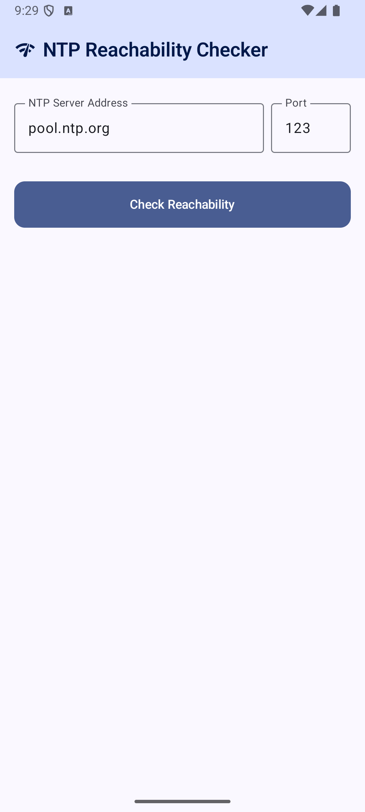
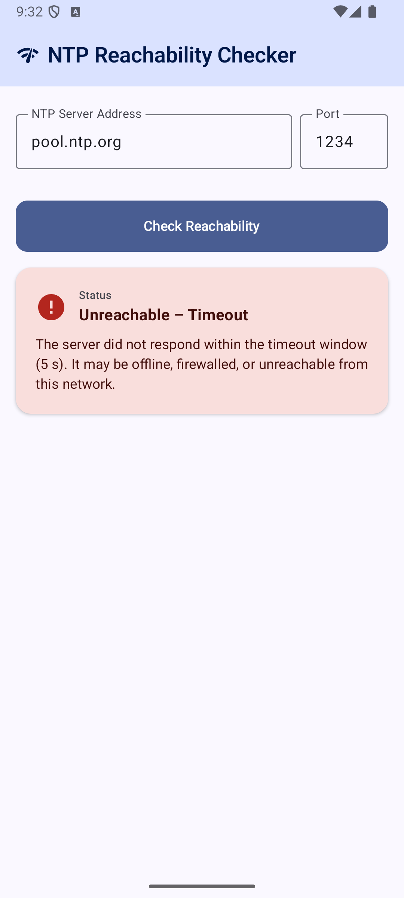

# NTP Reachability Checker

A minimal, modern Android app that tests the reachability of any NTP (Network Time Protocol) server and displays detailed timing metrics.

## Visuals
|Success | DNS Failure | Timeout |
|---|---|---|
||||

## Features

- Enter any NTP server address (defaults to `pool.ntp.org`)
- Displays:
  - ✅ / ❌ Reachability status
  - 🕒 Server Time
  - ⏱ Clock Offset (ms)
  - 📡 Round-Trip Delay (ms)
- Graceful error handling for DNS failures, timeouts, and no-network states
- Animated result card with Material You dynamic colors

## Stack

| Layer | Technology |
|---|---|
| Language | Kotlin |
| UI | Jetpack Compose + Material 3 |
| Architecture | MVVM (ViewModel + StateFlow) |
| Concurrency | Kotlin Coroutines (`Dispatchers.IO`) |
| NTP | Apache Commons Net 3.11.1 (`NTPUDPClient`) |
| Min SDK | 26 (Android 8.0) |
| Target SDK | 35 (Android 15) |

## Project Structure

```
app/src/main/java/io/github/mobilutils/simplentpchecker/
├─SimpleNtpRepository.kt   # Network I/O — NTPUDPClient + sealed NtpResult
├─SimpleNtpViewModel.kt    # UI state (StateFlow<NtpUiState>), coroutine lifecycle
├── MainActivity.kt    # Jetpack Compose UI
└── ui/theme/          # Material 3 colors, typography, theme
```

## Requirements

- Android Studio Hedgehog (2023.1.1) or newer
- Android SDK 35 installed
- A device or emulator running Android 8.0+ (API 26+)

## Running the App

### Android Studio

1. Open Android Studio → **File → Open** → select this folder
2. Wait for Gradle sync to complete
3. Connect a device or start an emulator
4. Press **▶ Run**

### Command Line

```bash
# Build and install debug APK
./gradlew installDebug

# Launch on connected device
adb shell am start -n io.github.mobilutils.simplentpchecker/.MainActivity
```

## Permissions

```xml
<uses-permission android:name="android.permission.INTERNET" />
```

Only `INTERNET` is required. No location, storage, or other sensitive permissions are used.

## Error States

| Error | Cause |
|---|---|
| DNS Failure | Hostname could not be resolved |
| Timeout | Server did not respond within 5 seconds |
| No Network | Device has no active internet connection |
| Error | Any other unexpected exception |

## License

MIT
